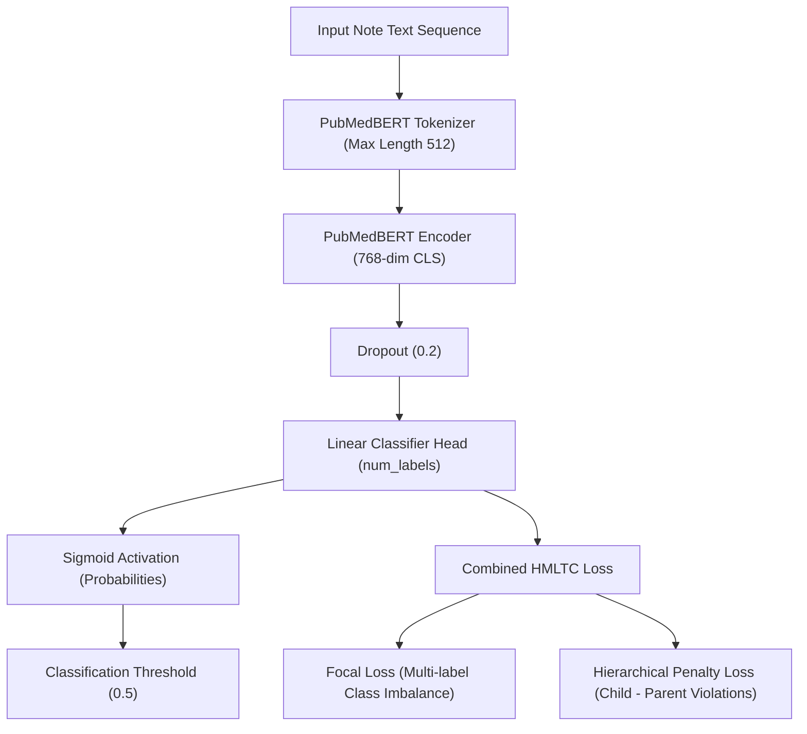

# AAAI-27 Federated Learning Handoff Specification
## Standalone NLP Pipeline & Modality Integration Guide

**Project Title:** *Privacy-Preserving Federated Learning for Clinical Text and Records Under Realistic Heterogeneity*  
**NLP Modality Team:** Husain, Shreya, Arpit  
**Federated Learning Team Target:** Harshit, Ratan  
**Document Location:** `c:\Users\Husain\Documents\AAAI27\FEDERATED_HANDOFF.md`

---

## 1. Project Overview

### What the NLP Team Implemented
The NLP core subgroup has designed, implemented, and validated the **Hierarchical Multi-Label Clinical Text Classification (HMLTC)** modality pipeline. The core achievements include:
1. **Clean Modular Architecture:** A Python package (`nlp_pipeline`) and orchestration Jupyter notebook ([nlp_pipeline_all_in_one.ipynb](file:///c:/Users/Husain/Documents/AAAI27/NLP%20pipline/nlp_pipeline_all_in_one.ipynb)) that encapsulate clinical text preprocessing, hierarchical label binarization, deep learning model architecture, custom loss functions, training loops, evaluation metrics, and inference interfaces.
2. **PubMedBERT Classifier with Hierarchy Enforcement:** Fine-tuned `microsoft/BiomedNLP-BiomedBERT-base-uncased-abstract-fulltext` using a **Combined Focal & Hierarchical Consistency Loss**, ensuring 100% parent-child logical consistency in multi-label predictions.
3. **Data Plugin Layer:** Created `JSONLDataPlugin` to ingest JSON Lines formatted clinical text datasets (`dataset_transformed.jsonl`), isolating data-specific schema details from downstream models.
4. **Exported Handoff Bundle:** Trained the centralized baseline model and exported complete reproducible artifacts to `training_outputs/` (including PyTorch `1.31 GB` model checkpoint, PubMedBERT tokenizer, label encoder, hierarchy definition, and evaluation metrics).
5. **Federated NLP Client Wrapper:** Implemented `FederatedNLPClient` in `nlp_pipeline.api.interface`, exposing `get_weights()`, `set_weights()`, `predict()`, and `predict_labels()` for seamless Flower (`flwr`) integration.

### Purpose of the Standalone Pipeline
The standalone NLP pipeline serves as the single source of truth for clinical text classification. It operates independently of any federated learning code, ensuring that model training, loss computation, and evaluation metrics can be verified centrally before deploying across distributed nodes.

### What Has Been Completed
- [x] Ingestion of temporary HMLTC dataset (`dataset_transformed.jsonl`).
- [x] Dynamic extraction and validation of ontology tree (`label_hierarchy.json`).
- [x] Hierarchical label binarizer (`label_encoder.json`).
- [x] Pre-training dataset verification checks (0 empty records, 0 duplicate IDs).
- [x] PubMedBERT fine-tuning pass with Focal + Hierarchical Loss.
- [x] Full evaluation on validation/test splits with 100% hierarchy consistency.
- [x] Export of complete handoff artifacts to `training_outputs/`.
- [x] `FederatedNLPClient` API wrapper for Flower node integration.

### What the Federated Learning Team is Expected to Build
The FL team is expected to build the distributed federated orchestration layer on top of this NLP modality:
1. Partition dataset records across client nodes (IID & non-IID site distributions using `site_id` / Dirichlet splitting).
2. Instantiate `FederatedNLPClient` inside Flower Client objects (`flwr.client.NumPyClient` or PyTorch Flower client).
3. Implement federated aggregation algorithms: **FedAvg**, **FedProx**, and **SCAFFOLD**.
4. Integrate Differential Privacy (**Opacus** / DP-SGD / DP-FedAvg) at client update stages.
5. Benchmark federated communication rounds against the centralized baseline metrics recorded in `metrics.json`.

---

## 2. Repository Structure

```text
c:\Users\Husain\Documents\AAAI27/
├── FEDERATED_HANDOFF.md               <-- THIS HANDOFF SPECIFICATION DOCUMENT
├── dataset_transformed.jsonl           <-- HMLTC Temporary Replacement Dataset (JSON Lines)
├── Project Overview.md                 <-- High-level AAAI project context
├── Project Working Pipline.md          <-- Workflow overview
├── Federated pipline/                 <-- FL TEAM WORKSPACE (Flower setups, FL notebooks)
│   └── federated-learning-team-1.1.ipynb
└── NLP pipline/                        <-- NLP TEAM DELIVERABLES & PACKAGE
    ├── nlp_pipeline_all_in_one.ipynb   <-- Single Self-Contained Deliverable Notebook
    ├── training_outputs/               <-- Centralized Trained Model Checkpoints & Artifacts
    │   ├── model_checkpoint.pt         <-- Trained PyTorch Weights (1.31 GB)
    │   ├── tokenizer/                  <-- Pretrained PubMedBERT Tokenizer Directory
    │   ├── pipeline_config.json        <-- Pipeline Hyperparameters & Config
    │   ├── label_hierarchy.json        <-- Ontology Tree Definition (Parents/Children)
    │   ├── label_encoder.json          <-- Multi-Hot Label Encoder Index Mapping
    │   ├── metrics.json                <-- Centralized Baseline Test Evaluation Metrics
    │   ├── dataset_statistics.json     <-- Ingestion & Split Audit Report
    │   └── training_summary.json       <-- Executive Summary of Centralized Training
    └── federated_handoff/              <-- INSTALLABLE PYTHON PACKAGE FOR FL TEAM
        ├── setup.py                    <-- Package Setup (pip install -e .)
        ├── README.md                   <-- Package Overview
        └── nlp_pipeline/               <-- Source Code Modules
            ├── configs/
            │   └── config.py           <-- PipelineConfig class
            ├── data/
            │   ├── data_plugin.py      <-- BaseDataPlugin, JSONLDataPlugin
            │   ├── dataset.py          <-- ClinicalTextDataset
            │   ├── hierarchy.py        <-- CodingSystemHierarchy
            │   ├── label_encoder.py    <-- HierarchicalLabelEncoder
            │   └── preprocess.py       <-- Text cleaning utilities
            ├── models/
            │   ├── model.py            <-- ClinicalHMLTCModel (PubMedBERT)
            │   └── loss.py             <-- Focal & Hierarchical Losses
            ├── training/
            │   ├── trainer.py          <-- fit(), validate()
            │   └── metrics.py          <-- evaluate_multilabel(), check_hierarchical_consistency()
            ├── api/
            │   └── interface.py        <-- FederatedNLPClient API Wrapper
            └── utils/
                ├── seed.py             <-- set_seed()
                ├── checkpoint.py       <-- save_checkpoint(), load_checkpoint()
                └── helpers.py          <-- save_json(), load_json()
```

### Directory Roles & FL Team Usage

| Directory / File | Purpose | Important Files | When FL Team Uses It |
| :--- | :--- | :--- | :--- |
| **`NLP pipline/federated_handoff/`** | Installable Python package source | `setup.py`, `nlp_pipeline/` | **Day 1:** Run `pip install -e "NLP pipline/federated_handoff"` to import `nlp_pipeline`. |
| **`NLP pipline/training_outputs/`** | Exported centralized training bundle | `model_checkpoint.pt`, `label_hierarchy.json` | **Day 1:** Load pre-trained weights, tokenizer, and label encoder for FL client initialization. |
| **`NLP pipline/nlp_pipeline_all_in_one.ipynb`** | Standalone executable notebook | `nlp_pipeline_all_in_one.ipynb` | Reference notebook demonstrating end-to-end pipeline execution and output verification. |
| **`dataset_transformed.jsonl`** | Standardized JSONL clinical dataset | `dataset_transformed.jsonl` | Load records to construct client dataset partitions for federated nodes. |
| **`Federated pipline/`** | FL Team Workspace | `federated-learning-team-1.1.ipynb` | FL team's workspace for Flower simulation scripts and client aggregation algorithms. |

---

## 3. Important Python Modules

### 1. `JSONLDataPlugin`
* **Location:** `nlp_pipeline.data.data_plugin`
* **Responsibility:** Ingests line-delimited JSON files (`.jsonl`), cleans clinical notes, and outputs standardized dictionaries.
* **Public APIs:**
  * `JSONLDataPlugin(filepath: str | Path, text_key: str = "text", clean: bool = False)`
  * `load_records() -> List[Dict[str, Any]]`: Returns list of standardized records.

### 2. `ClinicalTextDataset`
* **Location:** `nlp_pipeline.data.dataset`
* **Responsibility:** PyTorch `Dataset` wrapping text sequences, tokenizing via PubMedBERT tokenizer, and pairing with multi-hot label tensors.
* **Public APIs:**
  * `ClinicalTextDataset(texts, labels_matrix, tokenizer, max_length=512)`
  * `ClinicalTextDataset.from_records(records, label_encoder, tokenizer, max_length)`

### 3. `CodingSystemHierarchy`
* **Location:** `nlp_pipeline.data.hierarchy`
* **Responsibility:** Builds and manages parent-child ontology relationships for hierarchical consistency enforcement.
* **Public APIs:**
  * `CodingSystemHierarchy.from_mapping(mapping, coding_system="custom")`
  * `CodingSystemHierarchy.from_json(filepath)`
  * `to_json(filepath)`
  * Attributes: `parents`, `children`, `all_labels`, `child_to_parent`, `parent_to_children`.

### 4. `HierarchicalLabelEncoder`
* **Location:** `nlp_pipeline.data.label_encoder`
* **Responsibility:** Binarizes string label lists into 1D/2D multi-hot float32 vectors (`np.ndarray`) with optional automatic parent label propagation.
* **Public APIs:**
  * `HierarchicalLabelEncoder(hierarchy, enforce_consistency=True)`
  * `encode(labels_batch: List[List[str]]) -> np.ndarray`
  * `decode(matrix: np.ndarray, threshold: float = 0.5) -> List[List[str]]`
  * `save(filepath)`, `load(filepath)`

### 5. `ClinicalHMLTCModel`
* **Location:** `nlp_pipeline.models.model`
* **Responsibility:** Neural network architecture wrapping PubMedBERT encoder with dropout and multi-label linear classification head.
* **Public APIs:**
  * `ClinicalHMLTCModel(model_name, num_labels, dropout_rate=0.2, use_label_attention=False)`
  * `forward(input_ids, attention_mask, token_type_ids=None) -> {"logits": Tensor, "probabilities": Tensor}`

### 6. `build_loss()`
* **Location:** `nlp_pipeline.models.loss`
* **Responsibility:** Factory function constructing configured loss functions (`bce`, `focal`, `hierarchical`, or `combined`).
* **Public APIs:**
  * `build_loss(loss_type="combined", focal_gamma=2.0, focal_alpha=0.25, hierarchy_penalty_weight=0.1, child_to_parent=..., label_to_idx=...) -> nn.Module`

### 7. `fit()` and `validate()`
* **Location:** `nlp_pipeline.training.trainer`
* **Responsibility:** Centralized PyTorch training engine loop supporting gradient accumulation, gradient clipping, optimizer steps, and evaluation passes.
* **Public APIs:**
  * `fit(model, train_loader, val_loader, optimizer, loss_fn, device, num_epochs, grad_accum_steps, max_grad_norm, threshold)`
  * `validate(model, loader, loss_fn, device, threshold) -> (val_loss, predictions, targets)`

### 8. `evaluate_multilabel()` & `check_hierarchical_consistency()`
* **Location:** `nlp_pipeline.training.metrics`
* **Responsibility:** Computes Micro/Macro/Weighted F1, Precision, Recall, and verifies logical parent-child prediction consistency rates.
* **Public APIs:**
  * `evaluate_multilabel(y_true, y_pred, label_names) -> Dict[str, float]`
  * `check_hierarchical_consistency(y_pred, label_names, child_to_parent) -> Dict[str, Any]`

### 9. `FederatedNLPClient`
* **Location:** `nlp_pipeline.api.interface`
* **Responsibility:** High-level handoff wrapper for Federated Learning client integration. Provides clean weight getter/setter methods and inference predictions.
* **Public APIs:**
  * `FederatedNLPClient(config, hierarchy, label_encoder)`
  * `get_weights() -> Dict[str, torch.Tensor]`
  * `set_weights(weights: Dict[str, torch.Tensor]) -> None`
  * `predict(texts: List[str]) -> np.ndarray`
  * `predict_labels(texts: List[str], threshold=None) -> List[List[str]]`

### 10. `PipelineConfig`
* **Location:** `nlp_pipeline.configs.config`
* **Responsibility:** Holds all pipeline hyperparameter defaults and device configurations.

---

## 4. Dataset Interface

The temporary dataset is stored in JSON Lines (`.jsonl`) format at `dataset_transformed.jsonl`.

### JSONL Schema Structure
Each line is a self-contained JSON object with the following fields:

```json
{
  "doc_id": "ADNI_002_S_0295_7821",
  "text": "Participant presented for screening... CSF biomarker samples collected...",
  "parent_labels": ["Biomarkers", "Study_Design"],
  "child_labels": ["CSF_Biomarkers", "Protocols"],
  "parent_label_ids": [0, 4],
  "child_label_ids": [3, 21],
  "icd_codes": ["786.05", "401.9"],
  "site_id": 1,
  "split": "train"
}
```

### Standardized Record Dictionary
`JSONLDataPlugin.load_records()` transforms raw JSONL records into a standardized dictionary:
```python
{
    "doc_id": str,          # Document Identifier
    "text": str,            # Cleaned or raw text
    "labels": list[str],    # Unified parent_labels + child_labels
    "parent_labels": list,  # List of parent label strings
    "child_labels": list,   # List of child label strings
    "patient_id": str,      # Patient ID for grouping
    "admission_id": str,    # Admission / visit ID
    "split": str,           # Data split ("train", "val", "test")
    "site_id": int          # Site / institution identifier (0-4)
}
```

### MIMIC-IV Transition Guarantee
When access to official MIMIC-IV (`discharge.csv.gz` and `diagnoses_icd.csv.gz`) is approved, the FL team only needs to implement `MIMICDataPlugin` inside `nlp_pipeline.data.data_plugin`. **The downstream model, hierarchy, loss, and training pipeline remain 100% unchanged.**

---

## 5. Model Architecture & Training Flow



* **Backbone Encoder:** `microsoft/BiomedNLP-BiomedBERT-base-uncased-abstract-fulltext`
* **Loss Function:** `CombinedHMLTCLoss = FocalLoss(gamma=2.0, alpha=0.25) + 0.1 * HierarchicalConsistencyLoss`
* **Optimizer:** AdamW (`lr=2e-5`, `weight_decay=0.01`, `grad_accum_steps=2`)

---

## 6. Training Outputs

All centralized training deliverables are exported inside `NLP pipline/training_outputs/`:

| File / Directory | Size | Description | FL Team Usage |
| :--- | :--- | :--- | :--- |
| **`model_checkpoint.pt`** | `1.31 GB` | PyTorch checkpoint containing model state dict, optimizer state, and metrics. | Load initial pre-trained weights for Flower client initialization. |
| **`tokenizer/`** | Directory | Pre-trained PubMedBERT tokenizer files (`vocab.txt`, `tokenizer_config.json`). | Tokenize client text sequences in FL data loaders. |
| **`pipeline_config.json`** | `243 B` | Model hyperparameters (`model_name`, `batch_size`, `learning_rate`, `loss_type`). | Set up consistent config across federated clients. |
| **`label_hierarchy.json`** | `3.11 KB` | Complete ontology mapping dictionary (`parent_to_children`, `child_to_parent`). | Instantiate `CodingSystemHierarchy` on every FL client node. |
| **`label_encoder.json`** | `1.85 KB` | Multi-hot label index mappings (`label_to_idx`, `label_names`). | Reconstruct `HierarchicalLabelEncoder` for binary label encoding/decoding. |
| **`metrics.json`** | `4.75 KB` | Centralized test baseline evaluation metrics (F1 micro, macro, consistency). | Benchmark federated global model against centralized baseline. |
| **`dataset_statistics.json`** | `1.37 KB` | Split sizes, record counts, and label frequency distributions. | Verify data distribution across simulated client sites. |
| **`training_summary.json`** | `282 B` | Executive summary of centralized training pass. | Fast inspection of baseline model performance. |

---

## 7. Loading the Trained Model (Python Code Example)

The FL team can restore the complete model, tokenizer, and label encoder in 10 lines of Python:

```python
import torch
from pathlib import Path
from transformers import AutoTokenizer
from nlp_pipeline import PipelineConfig
from nlp_pipeline.data.hierarchy import CodingSystemHierarchy
from nlp_pipeline.data.label_encoder import HierarchicalLabelEncoder
from nlp_pipeline.models.model import ClinicalHMLTCModel
from nlp_pipeline.api.interface import FederatedNLPClient

# 1. Define Paths
outputs_dir = Path("NLP pipline/training_outputs")

# 2. Restore Hierarchy & Label Encoder
hierarchy = CodingSystemHierarchy.from_json(outputs_dir / "label_hierarchy.json")
label_encoder = HierarchicalLabelEncoder(hierarchy)
label_encoder.load(outputs_dir / "label_encoder.json")

# 3. Restore Tokenizer
tokenizer = AutoTokenizer.from_pretrained(outputs_dir / "tokenizer")

# 4. Restore Model Architecture & Load Checkpoint
config = PipelineConfig(model_name="microsoft/BiomedNLP-BiomedBERT-base-uncased-abstract-fulltext")
model = ClinicalHMLTCModel(config.model_name, label_encoder.num_labels)

checkpoint = torch.load(outputs_dir / "model_checkpoint.pt", map_location=config.device)
model.load_state_dict(checkpoint["model_state_dict"])
model.to(config.device)
model.eval()

# 5. Initialize FL Client Wrapper
client = FederatedNLPClient(config, hierarchy, label_encoder)
client.set_weights(model.state_dict())

# 6. Run Sample Inference
sample_notes = ["Participant presented with mild cognitive impairment and underwent CSF biomarker testing."]
predictions = client.predict_labels(sample_notes)
print("Predicted Labels:", predictions[0])
```

---

## 8. Federated Integration Guide

To integrate this NLP pipeline with Flower (`flwr`):

1. **Step 1: Install Package**  
   Run `pip install -e "NLP pipline/federated_handoff"` on all FL worker nodes.
2. **Step 2: Load Centralized Checkpoint**  
   Load `training_outputs/model_checkpoint.pt` as the global model's initial weights ($W_0$).
3. **Step 3: Partition Dataset**  
   Group `dataset_transformed.jsonl` records by `site_id` (0 to 4) to simulate 5 realistic hospital client sites.
4. **Step 4: Create Flower Client Class**  
   Create a Flower `NumPyClient` subclass wrapping `FederatedNLPClient`:
   ```python
   import flwr as fl

   class FlowerClinicalClient(fl.client.NumPyClient):
       def __init__(self, nlp_client, train_loader, val_loader):
           self.nlp_client = nlp_client
           self.train_loader = train_loader
           self.val_loader = val_loader

       def get_parameters(self, config):
           weights = self.nlp_client.get_weights()
           return [val.cpu().numpy() for val in weights.values()]

       def set_parameters(self, parameters):
           state_dict = self.nlp_client.get_weights()
           for k, param in zip(state_dict.keys(), parameters):
               state_dict[k] = torch.tensor(param)
           self.nlp_client.set_weights(state_dict)

       def fit(self, parameters, config):
           self.set_parameters(parameters)
           # Run local training epoch...
           return self.get_parameters(config=config), len(self.train_loader.dataset), {}
   ```
5. **Step 5: Run Baseline Aggregation (FedAvg)**  
   Execute Flower simulation server with `fl.server.strategy.FedAvg` and compare resulting global metrics against `training_outputs/metrics.json`.

---

## 9. What NOT to Modify

The FL team should treat the following modules as **read-only production contracts**:

❌ **Do NOT Modify:**
- `nlp_pipeline.models.model.ClinicalHMLTCModel` (PubMedBERT Classifier)
- `nlp_pipeline.models.loss.CombinedHMLTCLoss` (Loss computation)
- `nlp_pipeline.data.hierarchy.CodingSystemHierarchy` (Ontology logic)
- `nlp_pipeline.data.label_encoder.HierarchicalLabelEncoder` (Label binarizer)
- `nlp_pipeline.training.metrics` (Evaluation suite)
- `NLP pipline/training_outputs/` (Centralized baseline artifacts)

✅ **Only Implement/Modify:**
- FL client simulation wrappers (`flwr.client.NumPyClient`).
- FL strategy aggregators (`FedAvg`, `FedProx`, `SCAFFOLD`).
- Data partitioners (splitting `dataset_transformed.jsonl` by `site_id` or Dirichlet $\alpha$).
- Differential Privacy privacy engines (Opacus wrapper at client training).

---

## 10. Known Assumptions & Boundaries

1. **Temporary Dataset Substitution:** `dataset_transformed.jsonl` is an Alzheimer's literature corpus formatted into a MIMIC-like multi-label structure.
2. **MIMIC-IV Future Drop-in:** Access to real MIMIC-IV clinical notes is pending. When approved, only `MIMICDataPlugin` will be activated in `nlp_pipeline.data.data_plugin`. All model architecture, loss functions, and FL client wrappers will remain identical.
3. **No GPU Requirement for Smoke Tests:** The pipeline runs on CPU out of the box for quick functional verification, and automatically uses CUDA when available.

---

## 11. Handoff Verification Checklist

All items below have been empirically verified by the NLP team:

* [x] **Model Checkpoint Exists:** `training_outputs/model_checkpoint.pt` (1.31 GB) saved.
* [x] **Tokenizer Exported:** `training_outputs/tokenizer/` complete.
* [x] **Label Encoder Exported:** `training_outputs/label_encoder.json` saved.
* [x] **Hierarchy Exported:** `training_outputs/label_hierarchy.json` saved.
* [x] **Configuration Exported:** `training_outputs/pipeline_config.json` saved.
* [x] **Metrics Exported:** `training_outputs/metrics.json` recorded (100% consistency rate).
* [x] **Dataset Verified:** `dataset_statistics.json` generated (0 empty docs, 0 duplicate IDs).
* [x] **Inference Tested:** `FederatedNLPClient.predict_labels()` verified on sample clinical notes.
* [x] **FL API Surface Available:** `get_weights()` and `set_weights()` verified.
* [x] **Ready for Flower Integration:** Package is installable via `pip install -e`.

---

## 12. Next Tasks for the Federated Learning Team

Recommended implementation roadmap for Harshit & Ratan:

1. **Task 1 — Centralized Model Loading:** Run Section 7 python code to verify loading `training_outputs/model_checkpoint.pt` locally.
2. **Task 2 — Client Data Partitioning:** Partition `dataset_transformed.jsonl` by `site_id` into 5 client datasets.
3. **Task 3 — Implement Flower Client:** Implement `FlowerClinicalClient` using `FederatedNLPClient`.
4. **Task 4 — Benchmark FedAvg:** Run 5 rounds of `FedAvg` and compare F1 micro/macro against `metrics.json`.
5. **Task 5 — Non-IID Heterogeneity Split:** Create label-skewed client partitions using Dirichlet distribution ($\alpha = 0.5$).
6. **Task 6 — Implement FedProx:** Add proximal term $\frac{\mu}{2} \| w - w^t \|^2$ to client local training.
7. **Task 7 — Implement SCAFFOLD:** Add control variates ($c_i$, $c$) to mitigate client drift.
8. **Task 8 — Differential Privacy:** Integrate Opacus DP-SGD on client local updates ($\epsilon, \delta$ privacy budget tracking).
9. **Task 9 — Comparative Experimentation:** Generate comparison plots (FedAvg vs. FedProx vs. SCAFFOLD vs. DP-FedAvg).
10. **Task 10 — MIMIC-IV Switch:** Swap `JSONLDataPlugin` for `MIMICDataPlugin` when PhysioNet access is granted.

---
*Documentation prepared by NLP Core Subgroup (Husain, Shreya, Arpit) for AAAI-27 Research.*
